 

 

## 📌 Обо мне

> 👋 Привет! Я **Вадим Кашапов** — frontend веб-разработчик
>
> 🚀 Изучаю **JavaScript** и **React**
>
> 🐳 Работаю с **Git** и **Docker**
>
> 🎯 Пишу код, который приятно читать

 

## 🛠️ Технологии

 

## 📊 Статистика

<!-- Если карточки ниже не грузятся — публичный сервер github-readme-stats.vercel.app перегружен.
     Задеплой свою копию за 2 минуты: https://github.com/anuraghazra/github-readme-stats#deploy-on-your-own
     Затем замени "github-readme-stats.vercel.app" на свой домен в двух ссылках ниже. -->

 

## 💻 Терминал

  

 

## 📈 График контрибуций

 

## 🐍 Snake Eating Contributions

 

